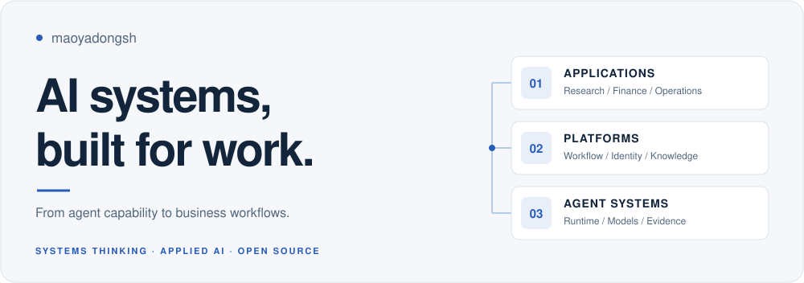

<picture>
  <source media="(prefers-color-scheme: dark)" srcset="assets/profile-hero-dark.svg" />
  
</picture>

<strong>Applied AI &amp; Enterprise Systems Engineering</strong> 
Bringing agent capabilities into business workflows, with clear boundaries and traceable results.

  <a href="README.md">简体中文</a> · <strong>English</strong> 
  <a href="#engineering-portfolio">Portfolio</a> · <a href="#open-source">Open source</a> · <a href="#technology-and-method">Technology &amp; method</a> · <a href="#connect">Connect</a>

My development work starts with **investment research and management, corporate governance and people operations**, extending into knowledge systems, Agent runtimes and security, and reusable enterprise services. I focus on how domain models, product interaction, evidence, access control and engineering validation fit together.

## Engineering portfolio

**Business applications → Knowledge &amp; research → Agent systems → Enterprise platform**

The portfolio moves from user workflows to supporting capabilities, spanning independent applications and the SIQ service ecosystem. Public projects link to source; private repositories show project names and engineering responsibilities.

### 01 · Business applications and decisions

BUSINESS APPLICATIONS · Investment research / Investment management / Governance / People operations

Organize domain models, evidence analysis and human decisions into usable product workflows.

| Project and repository | Engineering focus |
| :--- | :--- |
| **SIQ Investment** `siq-investment` Private repository | Investment management across GPs, funds and direct investments: fundraising, due diligence, investment committees, closing, portfolio management and exits, connected to cash flows, approvals and audit records. |
| **FinSight** `finsight` Private repository | A research workbench bringing financial report retrieval, parsing, analysis, fact-checking, monitoring and legal research together with multiple specialist agents. |
| **Group Corporate Governance Platform** Private project | Organizes entity records, ownership relationships, proposals, resolutions and governance documents for a group and its member companies, with information lookup, evidence tracing and analysis. |
| **HRsight** `hrsight` Private repository | A people operations MVP for groups and subsidiaries, combining talent dashboards, HR workflows, reports, tasks, policy Q&amp;A and legal compliance. |

### 02 · Knowledge and research engineering

KNOWLEDGE &amp; RESEARCH · Document understanding / Structured facts / Retrieval and memory

Turn source materials into citable facts and knowledge, preserving the context and evidence behind research.

| Project and repository | Engineering focus |
| :--- | :--- |
| **SIQ Research Engine** `siq-research-engine` Private repository | Connects official disclosures across markets, financial report parsing, LLM Wiki evidence organization, retrieval and multi-agent research, with quality checks and human sign-off. |
| **SIQ Document Engine** `siq-document-engine` Private repository | Converts PDF and Office materials into versioned parsing artifacts, with quality checks, source location tracking, citation verification and retrieval. |
| **SIQ Memory** `siq-memory` Private repository | Manages user preferences, corrections and project context across sessions, including candidate confirmation, authorized retrieval, retention, deletion and retrieval receipts. |

### 03 · Agent runtimes and security

AGENT SYSTEMS · Execution / Lifecycle governance / Authorization and effect verification

Address agent execution, deployment and management, and the authorization and observable effects of tool actions.

| Project and repository | Engineering focus |
| :--- | :--- |
| **[SIQ Agent Security](https://github.com/maoyadongsh/siq-agent-security)** `siq-agent-security` Open source | An independent security runtime for Agent Skills: authorization and argument provenance checks, signed receipts and effect evidence, with public cases and reproduction tools. |
| **SIQ Agent Hub** `siq-agent-hub` Private repository | A control plane for agent registration, versioned assets, evaluation gates, runtime lifecycle and session records, integrating data policy and evidence checks. |
| **Hermes Agent · SIQ adaptation** `hermes-agent` Private repository | SIQ adaptations of Nous Research's [Hermes Agent](https://github.com/NousResearch/hermes-agent), focused on runtime state directory isolation, tool allowlists and platform integration. |

### 04 · Enterprise platform and collaboration

ENTERPRISE PLATFORM · Identity / Workflows / Model governance / Deployment

Connect identity, workflows, interfaces, messaging and deployment through clear service boundaries that business applications can reuse.

| Project and repository | Engineering focus |
| :--- | :--- |
| **SIQ Org IAM** `siq-org-iam` Private repository | Shared identity and organization services for users, positions, roles, data permissions, sessions, service identities and delegated authorization. |
| **SIQ Flow Engine** `siq-flow-engine` Private repository | Versioned process definitions for approvals, branching and task orchestration. Agents supply advisory opinions; human approvers make decisions. |
| **SIQ Gateway** `siq-gateway` Private repository | A common entry point for business APIs and model calls, governing model access, usage, quotas, circuit breakers and streaming requests. |
| **SIQ Workbench** `siq-workbench` Private repository | Dynamic forms, process design, approval inboxes, agent Q&amp;A and administration, with reusable form and UI components. |
| **SIQ Notify** `siq-notify` Private repository | Turns process and business events into notifications, handling recipient resolution, delivery channels, retries and dead-letter replay. |
| **SIQ Platform** `siq-platform` Private repository | Maintains the SIQ deployment and integration baseline: service topology, environment initialization, database migrations, health checks and integration acceptance. |

## Open source

### [SIQ Agent Security](https://github.com/maoyadongsh/siq-agent-security)

**Secure Runtime for Agent Skills**

> Agent Skills define what agents can do. SIQ defines what they are allowed to do.

A local Go runtime, tool adapters, provenance constraints, signed receipts and effect verification. The public source prerelease, fixed control cases and reproduction guide make the implementation and its supporting evidence inspectable.

[Explore the project](https://github.com/maoyadongsh/siq-agent-security) · [Quick start](https://github.com/maoyadongsh/siq-agent-security/blob/main/README.en.md#quick-start) · [Reproduction](https://github.com/maoyadongsh/siq-agent-security/blob/main/REPRODUCIBILITY.md) · [Source prerelease](https://github.com/maoyadongsh/siq-agent-security/releases/tag/research-v0.1.0-rc.1)

## Technology and method

| Engineering layer | Technologies used |
| :--- | :--- |
| Runtimes &amp; services | Go · Python · FastAPI · Versioned APIs |
| Product &amp; interaction | TypeScript · React · Vite |
| Data &amp; knowledge | PostgreSQL · Redis · Milvus · Object storage |
| Operations &amp; delivery | Docker Compose · Local model serving · CI · Contract &amp; regression validation |

**What I focus on:** clear domain and service boundaries, traceable data and judgments, recoverable execution, and reviewable tests and delivery records. AI-assisted development also needs a complete cycle of design, implementation, review and regression checks.

**Vibe Coding Prompt Library** · `vibecoding-prompts` · **Private repository** 
Reusable prompts for AI-assisted engineering, covering requirements and domain design, architecture and delivery planning, incremental implementation, maintenance and recovery, adversarial review and regression acceptance. Documents and verification records connect the development stages.

## Connect

Conversations about **enterprise AI, Agent infrastructure, knowledge and research systems, and engineering validation** are welcome. For public-project discussions and reproduction feedback, start in [SIQ Discussions](https://github.com/maoyadongsh/siq-agent-security/discussions) or choose a [community task](https://github.com/maoyadongsh/siq-agent-security/blob/main/docs/research/community-backlog.md). Report security issues through the [private channel](https://github.com/maoyadongsh/siq-agent-security/security/advisories/new).

---

Clear boundaries. Traceable evidence. Useful systems.

