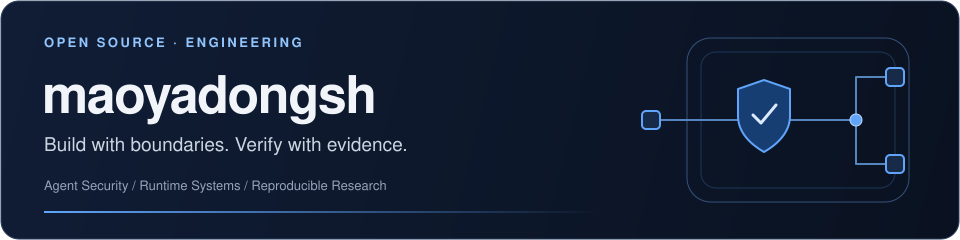

<picture>
  <source media="(prefers-color-scheme: dark)" srcset="assets/profile-header-dark.svg" />
  
</picture>

<strong>Applied AI &amp; Enterprise Systems Engineering</strong> 
Bringing agent capabilities into business workflows, with clear boundaries and traceable results.

  <a href="README.md">简体中文</a> · <strong>English</strong> 
  <a href="#engineering-portfolio">Portfolio</a> · <a href="#open-source">Open source</a> · <a href="#technology-and-method">Technology &amp; method</a> · <a href="#connect">Connect</a>

My development work spans **Agent runtimes and security, enterprise platforms, knowledge and research systems, and domain-specific AI applications**. I work across business modeling, service boundaries, product interaction, evidence, access control and engineering validation.

## Engineering portfolio

<table>
<tr>
<td width="50%" valign="top">

01 / AGENT SYSTEMS

<h3>Agent systems</h3>

Connect tool calls to authorization, provenance and effect evidence so Agent actions can be constrained and verified.

<strong>Runtime integration · Authorization · Effect verification</strong>

<a href="https://github.com/maoyadongsh/siq-agent-security">Public work: SIQ Agent Security →</a>

</td>
<td width="50%" valign="top">

02 / ENTERPRISE PLATFORMS

<h3>Enterprise platforms</h3>

Connect identity, human approvals, model governance and unified workbenches into cooperating enterprise services.

<strong>Identity &amp; access · Workflows · Service governance</strong>

Private development · Capability overview

</td>
</tr>
<tr>
<td width="50%" valign="top">

03 / KNOWLEDGE &amp; RESEARCH

<h3>Knowledge &amp; research</h3>

Connect documents and structured evidence to retrieval and multi-agent analysis, keeping research grounded in source material.

<strong>Document understanding · Evidence lineage · Research workflows</strong>

Private development · Capability overview

</td>
<td width="50%" valign="top">

04 / BUSINESS APPLICATIONS

<h3>Business applications</h3>

Bring domain models, approvals and analysis into workflows for investment research and management, corporate governance and people operations.

<strong>Domain modeling · Decision support · Product interaction</strong>

Private development · Capability overview

</td>
</tr>
</table>

## Open source

### [SIQ Agent Security](https://github.com/maoyadongsh/siq-agent-security)

**Secure Runtime for Agent Skills**

> Agent Skills define what agents can do. SIQ defines what they are allowed to do.

A local Go runtime, tool adapters, provenance constraints, signed receipts and effect verification. The public source prerelease, fixed control cases and reproduction guide make the implementation and its supporting evidence inspectable.

[Explore the project](https://github.com/maoyadongsh/siq-agent-security) · [Quick start](https://github.com/maoyadongsh/siq-agent-security/blob/main/README.en.md#quick-start) · [Reproduction](https://github.com/maoyadongsh/siq-agent-security/blob/main/REPRODUCIBILITY.md) · [Source prerelease](https://github.com/maoyadongsh/siq-agent-security/releases/tag/research-v0.1.0-rc.1)

## Technology and method

| Engineering layer | Technologies used |
| :--- | :--- |
| Runtimes &amp; services | Go · Python · FastAPI · Versioned APIs |
| Product &amp; interaction | TypeScript · React · Vite |
| Data &amp; knowledge | PostgreSQL · Redis · Milvus · Object storage |
| Operations &amp; delivery | Docker Compose · Local model serving · CI · Contract &amp; regression validation |

**What I focus on:** clear domain and service boundaries, traceable data and judgments, recoverable execution, and reviewable tests and delivery records. AI-assisted development also needs a complete cycle of design, implementation, review and regression checks.

## Connect

Conversations about **enterprise AI, Agent infrastructure, knowledge and research systems, and engineering validation** are welcome. For public-project discussions and reproduction feedback, start in [SIQ Discussions](https://github.com/maoyadongsh/siq-agent-security/discussions) or choose a [community task](https://github.com/maoyadongsh/siq-agent-security/blob/main/docs/research/community-backlog.md). Report security issues through the [private channel](https://github.com/maoyadongsh/siq-agent-security/security/advisories/new).

---

Clear boundaries. Traceable evidence. Useful systems.

